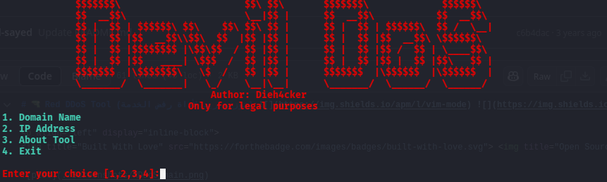

# Devil Dos Tool



## ⚠️ WARNING: THIS TOOL IS FOR EDUCATIONAL PURPOSES ONLY ⚠️

## Description
Devil Dos is a lightweight, terminal-based DoS (Denial of Service) attack simulation tool written in Python. It generates UDP packet floods to test the stress limits of target services under ethical and controlled environments.

## Features
- Terminal-based interface with ASCII art banner
- Choose target by domain or IP address
- Select specific port or use port rotation
- Real-time packet sending status
- Usage disclaimer and safety warnings

## Usage Disclaimer
- ✓ Educational research
- ✓ Penetration testing (with permission)
- ✓ Network resilience testing (on owned systems)

❗ Unauthorized use against any public or private system without explicit permission is illegal and unethical.
❗ The creator is not responsible for any misuse or damage caused.

## Requirements
- Python 3.x
- Works on Windows, Linux, and macOS

## Installation
Clone the repository and navigate to the project folder:

```bash
git clone https://github.com/deih4cker/Devil_Dos.git
cd devil-dos-tool
```

## How to Run
Run the tool using Python:

```bash
python Devil_Dos/Devil_dos.py
```

## Screenshots


## Author
- **Dieh4cker**

## License
This project is for educational purposes only. Respect the law. Respect the community.

---

> **Note:** This tool is intended for ethical testing and research only. Never use it on systems you do not own or have explicit permission to test.
